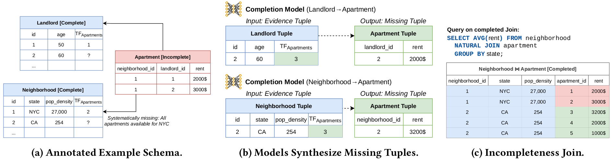

# ReStore - Neural Data Completion for Relational Databases

This repository contains the code for our paper "ReStore - Neural Data Completion for Relational Databases".
[\[paper\]](https://dl.acm.org/doi/10.1145/3448016.3457264) [\[arXiv\]](https://arxiv.org/abs/2105.12457)



Below we describe the steps required to reproduce our experiments. We additionally provide the notebooks and data that
were used to generate all plots in the paper (`exp_bias_reduction.ipynb`, `exp_confidence_intervals.ipynb`
and `exp_query_processing.ipynb`).

## Setup

Setup Python Environment

```
python3 -m venv venv
source venv/bin/activate
pip3 install --upgrade setuptools
pip3 install --upgrade pip
pip3 install -r requirements.txt
```

The requirements contain the torch versions for GPU and Cuda 10.1. If you want to run on CPU instead, simply install the
CPU versions of pytorch.

## Reproduce Experiments

Download
the [Housing](https://public.opendatasoft.com/explore/dataset/airbnb-listings/download/?format=csv&timezone=Europe/Berlin&lang=en&use_labels_for_header=true&csv_separator=%3B)
and [Movies Datasets](http://homepages.cwi.nl/~boncz/job/imdb.tgz)
and move them to `../research-data/incomplete-db/airbnb/all-raw` and `../research-data/incomplete-db/imdb/all-raw`.

Normalize the Data

```
python3 completion.py --preprocess --dataset airbnb --raw_data_directory ../research-data/incomplete-db/airbnb/all-raw --normalized_data_directory ../research-data/incomplete-db/airbnb/preprocessed
python3 completion.py --preprocess --dataset imdb --raw_data_directory ../research-data/incomplete-db/imdb/all-raw --normalized_data_directory ../research-data/incomplete-db/imdb/preprocessed
```

Generate the HDF files

```
python3 completion.py --generate_hdf --dataset airbnb --normalized_data_directory ../research-data/incomplete-db/airbnb/preprocessed --hdf_data_directory ../research-data/incomplete-db/airbnb/hdf_preprocessed
python3 completion.py --generate_hdf --dataset imdb --normalized_data_directory ../research-data/incomplete-db/imdb/preprocessed --hdf_data_directory ../research-data/incomplete-db/imdb/hdf_preprocessed
```

Generate all Commands for the Experiments. Append `--device cuda` if you want to run on GPU.

```
python3 exp_commands.py
```

Plots were generated using `exp_bias_reduction.ipynb`, `exp_confidence_intervals.ipynb` and `exp_query_processing.ipynb`

## Citation

If you find this code useful in your research, please consider citing:

```
@inproceedings{10.1145/3448016.3457264,
      author = {Hilprecht, Benjamin and Binnig, Carsten},
      title = {ReStore - Neural Data Completion for Relational Databases},
      year = {2021},
      isbn = {9781450383431},
      publisher = {Association for Computing Machinery},
      address = {New York, NY, USA},
      url = {https://doi.org/10.1145/3448016.3457264},
      doi = {10.1145/3448016.3457264},
      booktitle = {Proceedings of the 2021 International Conference on Management of Data},
      pages = {710–722},
      numpages = {13},
      keywords = {incomplete data, deep autoregressive models, data-driven learning, data completion, relational data},
      location = {Virtual Event, China},
      series = {SIGMOD/PODS '21}
}
```
